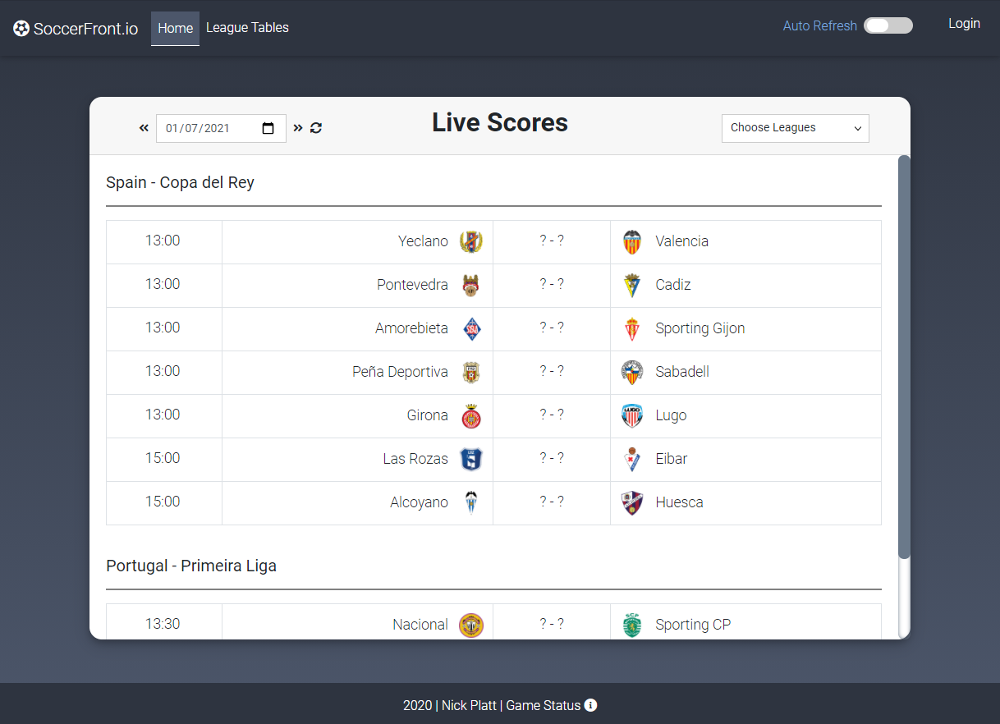
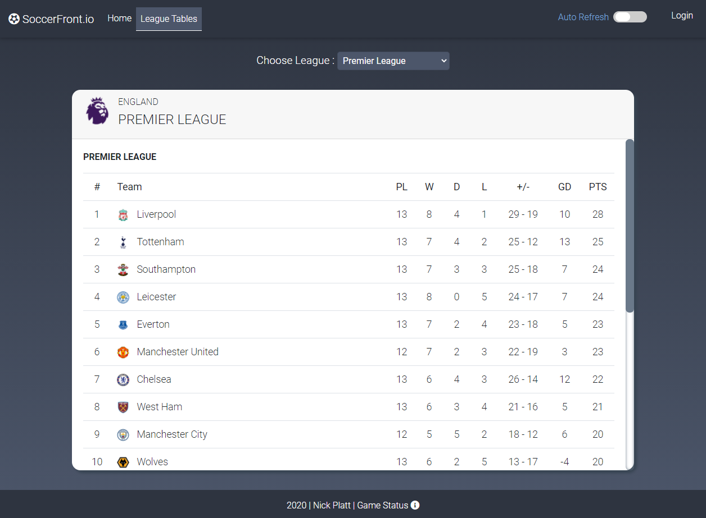

# Soccerfront
<strong>The Front Page of Soccer</strong>
Updated 11/16/2020

Current Homepage View: 

Current League Table View: 

<h1>Overview</h1>
This web application is run in Nodejs using the Express framework.  The application is built using HTML, CSS, and JavaScript. 

Soccerfront is the front page of soccer, showing you today's games in Europe's top leagues.  This table offers the ability to see one week of soccer, 3 days in the past, today, and 3 days in the future.  You are able to change the day by clicking on the date dropdown.  You are also able to turn off/on leagues that interest you in the "Choose Leagues" dropdown.

You are also able to look at the league standings for these leagues by clicking on the "League Tables" link in the banner.  The league table page will let you select the league you want to see and shows the team's position, games played, wins, ties, losses, goals for/against, goal difference, and overall points.  You are able to choose what league table you want to see by using the "Choose League" dropdown.

Future features include: expanded leagues, additional match details on row click (who scored, assisted, yellow cards, red cards, substitutions - with times), ability to signup/login and set favorite leagues, calendar date chooser (over only one week view), breaking news (including injuries/transfers) page, and many others!

<h2>Leagues Supported:<h2>

* England

	* Premier League  
	* Championship  
	* League One  
	* FA Cup 

* Germany  

	* Bundesliga  
	* Bundesliga 2  
	* 3. Liga  
	* DFB Pokal  

*