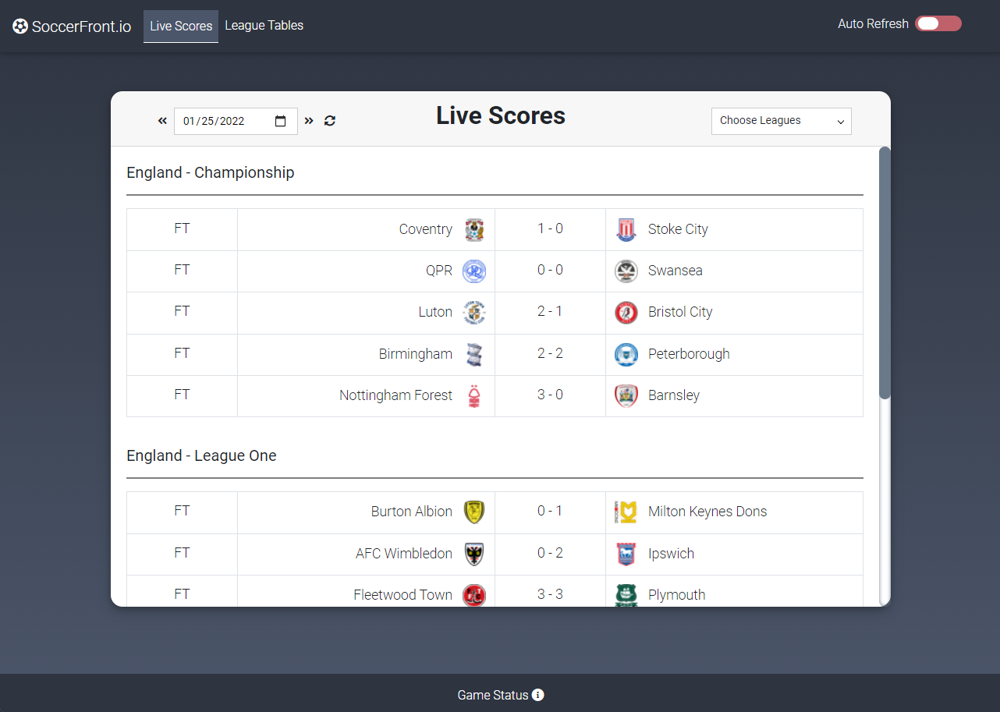

# Soccerfront

<strong>The Front Page of Soccer</strong> 
Last updated: 01/25/2022

Current Homepage View: 

Current League Table View: 

<h1>Overview</h1>
This web application is run in Nodejs using the Express framework.  The application is built using HTML, CSS, and JavaScript.

Soccerfront is the front page of soccer, showing you today's games in Europe's top leagues. This table offers the ability to see several years of soccer score data, via the dropdown calendar date picker. You are able to change the day by clicking on the calendar dropdown or by using the date arrows, which will move you one day forward/back per click. You are also able to turn off/on leagues that interest you in the "Choose Leagues" dropdown. The "Auto Refresh" toggle in the banner also will update the table every 60 seconds when activated.

You are also able to look at the league standings for these leagues by clicking on the "League Tables" link in the banner. The league table page will let you select the league and season you want to see and shows the team's position, games played, wins, ties, losses, goals for/against, goal difference, and overall points. You are able to choose what league table you want to see by using the "Choose League" dropdown. You are able to choose which season you would like to see as well (back to 2013-2014) by clicking on the "Season" dropdown.

Future features include: expanded leagues, additional match details on row click (who scored, assisted, yellow cards, red cards, substitutions - with times), ability to signup/login and set favorite leagues, breaking news (including injuries/transfers) page, and many others!

<h2>Leagues Supported:<h2>

- World

  - International Friendlies
  - World Cup Qualification

- Europe

  - Champions League
  - Nations League
  - Europa League

- England

  - Premier League
  - Championship
  - League One
  - FA Cup

- Germany

  - Bundesliga
  - Bundesliga 2
  - 3 Liga
  - DFB Pokal

- Spain

  - La Liga
  - La Liga 2
  - Copa Del Rey

- Italy

  - Serie A
  - Serie B
  - Coppa Italia

- Netherlands

  - Eredivisie
  - KNVB Cup

- Portugal

  - Primeira Liga
